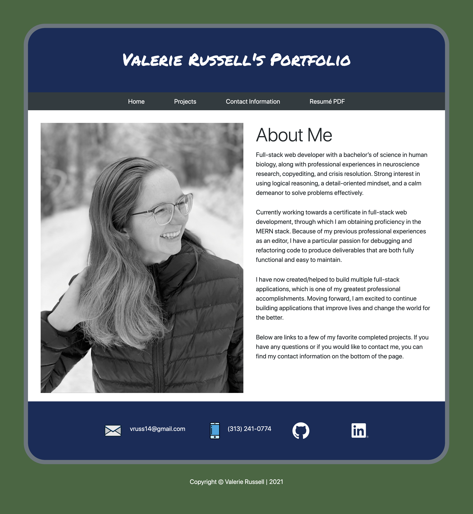
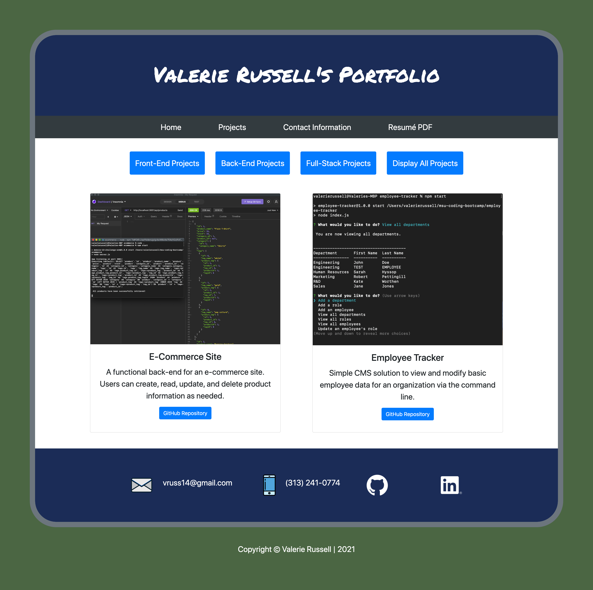

# React Portfolio

An updated version of my full-stack portfolio that implements React, a cutting-edge JavaScript library.

## Description

This website utilizes React to dynamically display information about myself and projects that I have recently built. Visitors can view six projects that I have created, and can filter them based on the type of project it is (front-end, back-end, and full-stack). The website also includes my contact information and a link to a PDF of my resume.

It was an interesting opportunity to take code that I previously created and refactor it to work with React. I gained a much better understanding of how to conceptually split a website/web application into several components. I also refactored the project section so that, rather than hard-coding each project in the projects section, unique information is imported for each project from a JSON file, ultimately making the portfolio more scalable. I also learned more about the .filter() and .map() functions in JavaScript, as well as conditional rendering in React.

Overall, creating this new portfolio was a great experience and I became more comfortable with React by creating it. I look forward to the projects that I will create with React in the future.

A few ideas for future development include:

- Splitting the app into more components that are smaller and serve only one purpose
- Changing the color of the active button on the projects page

## Technologies Used

- HTML5
- CSS3
- JavaScript
- React JS and JSX

## Table of Contents

- [Installation](#Installation)
- [Usage](#Usage)
- [License](#License)
- [Contributing](#Contributing)
- [Tests](#Tests)
- [Questions](#Questions)
            
## Installation

The application can be viewed live on GitHub Pages here: https://vruss14.github.io/react-portfolio/

Alternatively, the application can be cloned and run locally at port 3000. Navigate to the correct directory and run ```npm start``` in the command line to do so.

A view of the home page:



A view of two projects:



## Usage

This website is intended to be used by anyone interested in learning more about me as a developer and viewing projects that I have created.

## License

This project has not yet been licensed, and thus, standard copyright laws apply.
            
## Contributing

Valerie Russell is the sole contributor to this project. 
            
## Tests

There are currently no tests written for this project.
            
## Questions

If you have any questions about this application my GitHub username is vruss14 and you can view my GitHub profile at https://github.com/vruss14.

If you have additional questions, feel free to reach out to me at vruss14@gmail.com.
